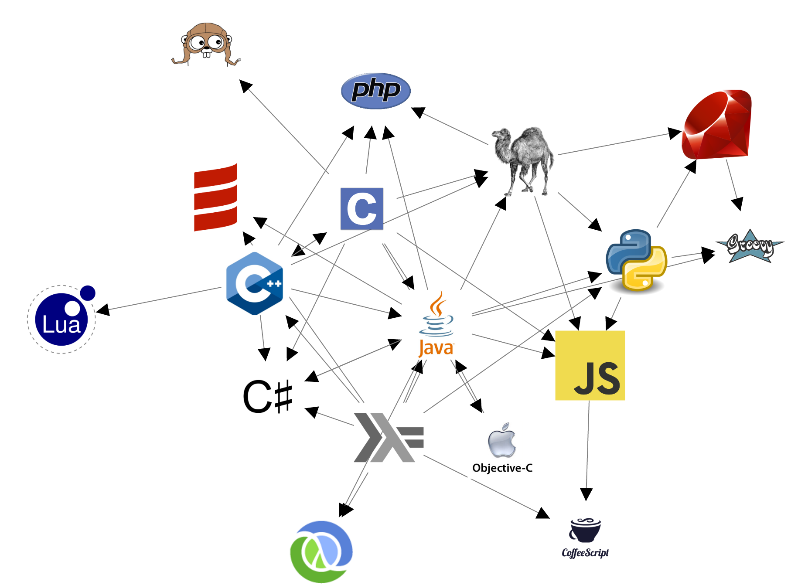

* Have a local Neo4j instance running
* Run 'bundle install --path vendor/bundle''
* Run 'bundle exec ruby ./setup.rb' (this step only needs to be done once to fill your local Neo4j instance with data). THIS DELETES ALL DATA IN THE DATABASE.
* Run 'bundle exec rackup'
* Access 'http://localhost:9292/index.html' in your favorite browser
* To look at the data that is being graphed you can go to 'http://localhost:9292/influenced'

